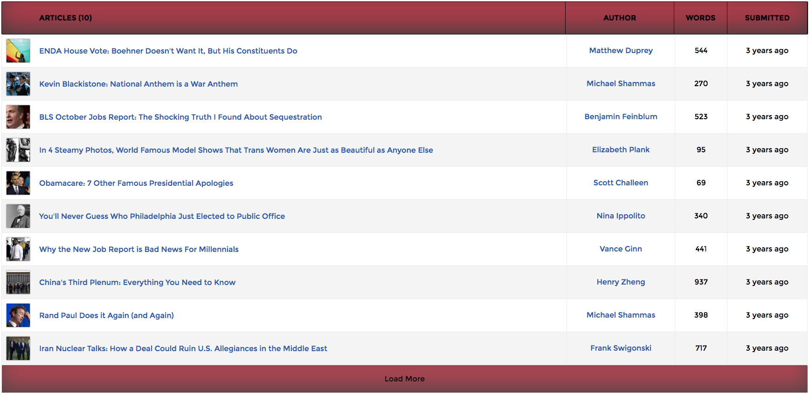

# Article List
This app loads a list of articles, ten at a time, from a JSON collection. The title and thumbnail of a list item are links to the article itself.
The list can be sorted by word count or published date, either ascending or descending, and sorting persists after navigating away from the page.

To get up and running:
1. Clone repo
2. Open a terminal and run:
  1. `npm install`
  2. `webpack --watch`
  3. `http-server`
5. In a browser open '0.0.0.0:8080' (or one of the URLs suggested by http-server)

